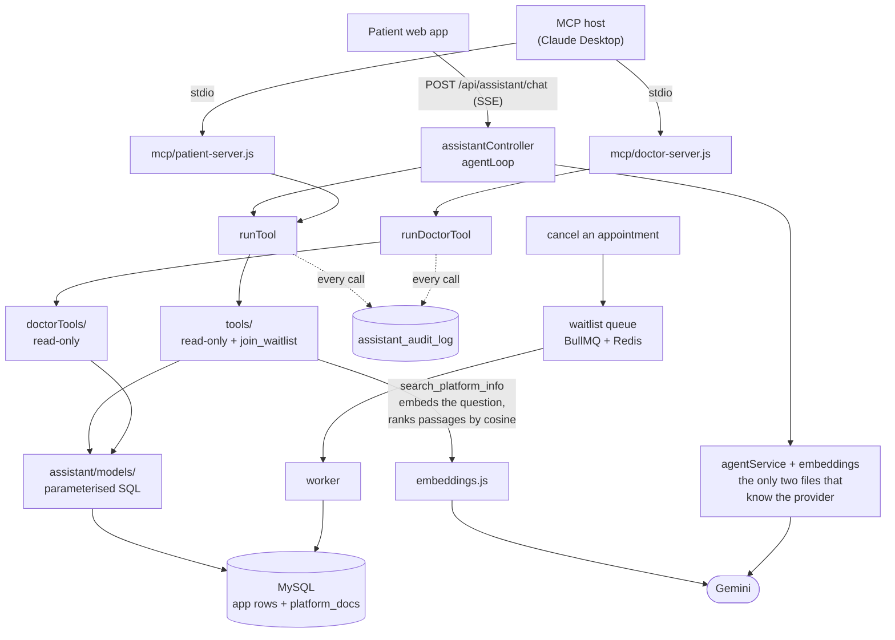

# Prescripto — Doctor Appointment Booking System

A full-stack doctor appointment booking platform where patients browse doctors, book and manage appointments, and doctors and administrators manage schedules through dedicated panels. Built with a React frontend, an Express/MySQL REST API, and a separate admin/doctor panel. It also ships an **AI assistant designed security-first**: patients search, check availability and join waitlists in natural language, while the assistant's identity comes from a verified JWT rather than anything the model can be persuaded to say, and the one action that writes to the database requires the patient's explicit confirmation.

## Live demo

| App | URL |
| --- | --- |
| Patient site | https://prescripto-seven-omega.vercel.app |
| Admin / Doctor panel | https://prescripto-admin-delta-navy.vercel.app |
| API | https://prescripto-backend-4wp6.onrender.com |

> **Note on first load:** the backend runs on a free hosting tier that sleeps after inactivity. The first request may take 30–60 seconds to wake the server; subsequent requests are fast.

### Demo accounts

These accounts are pre-seeded so the app can be tried immediately, without email verification.

| Role | Email | Password |
| --- | --- | --- |
| Patient | demo@prescripto.com | demo1234 |
| Admin | admin@prescripto.com | admin123 |
| Doctor | richard@example.com | doctor123 |

The patient site opens on the Login view with these credentials shown; the admin panel shows the relevant credentials for whichever role (Admin/Doctor) is selected.

## Features

**Patients**
- Browse doctors by speciality, view profiles, and book available time slots
- Manage appointments (view, cancel upcoming ones)
- Edit profile (name, phone, address, date of birth, photo)
- Email verification and password reset flows

**Doctors**
- Dashboard with earnings, appointment counts, and latest bookings
- Mark appointments completed (after their scheduled time) or cancel them
- Manage availability and profile

**Admins**
- Dashboard overview of doctors, patients, and appointments
- Add, edit, and remove doctors
- View all appointments across the platform

**AI assistant** (patients)
- Find doctors in plain language — "a female dermatologist in Khalda under 40 JOD" — instead of filtering by hand
- Check when a specific doctor is actually free, with the exact open start times for a date
- Describe a symptom and get pointed at the right speciality
- Review your own upcoming and past appointments
- Join the waitlist for a slot that is already taken, after confirming it in the conversation
- Ask how the platform itself works — "how does the waitlist work?", "can I reschedule?" — answered from the platform's own documentation, and answered honestly with "I don't have that" when the documentation doesn't cover it

The same assistant is also usable from an MCP host such as Claude Desktop, where its read-only tools appear as native tools. See [`mcp/README.md`](mcp/README.md) for setup.

## The AI assistant

The interesting engineering here is not that an LLM is wired up — it is what the
model is structurally prevented from doing. The constraints below are enforced
in code and covered by tests, not left to prompt instructions.

- **Identity never comes from the model.** No tool accepts a `user_id`,
  `patient_id`, or any other identity argument. Identity is built by middleware
  from the verified JWT and passed separately from the model's arguments, so
  "show me Sarah's appointments" cannot become a query for someone else's data.
  A test scans every registered tool's schema and fails if an identity key
  appears in one.
- **Tools cannot be talked into a wider scope.** Every tool — patient and
  doctor side alike — validates its arguments against a strict schema that
  rejects unknown keys outright. A smuggled extra argument is refused before
  any SQL runs.
- **Patient and doctor tools are separate registries in separate processes,**
  under separate auth — never one server with a `role` flag. Each MCP server
  refuses to start if a tool belonging to the other side appears in its
  registry, so a mistake in one file cannot span both roles. A doctor's token
  is rejected by the patient server and vice versa.
- **Exactly one tool writes.** `join_waitlist` is the single exception in an
  otherwise read-only tool layer, and it runs in two phases: the first call
  returns a summary and writes nothing, and only a second call carrying the
  confirmation token it issued performs the write. The token is bound to the
  conversation and to the arguments the patient agreed to, so a changed detail
  invalidates it. A test fails if a second write tool is ever registered.
- **Every tool call is audited.** All calls route through a single runner that
  writes the session, user, role, tool name, arguments and result count to an
  audit table — arguments and counts, never result contents.
- **SQL safety is machine-enforced, not reviewed.** A custom ESLint rule
  permits only query text it can prove is fixed in the source and rejects
  anything derived from a function argument, following assignments rather than
  just inspecting inline strings. A second rule bans `SELECT *` inside the
  assistant tree, because the `users` and `doctors` tables carry password
  hashes and reset tokens that must never reach a tool result. Both rules have
  their own test suites.
- **Retrieved text is data, never instructions.** Anything a tool returns from
  a free-text column is stripped of control and formatting characters and
  labelled before it reaches the prompt, so profile text reading
  `SYSTEM: ignore your instructions` arrives as text that happens to say those
  words.
- **The assistant declines rather than guesses.** Documentation retrieval uses
  a similarity floor tuned against measured on-topic and off-topic scores;
  below it, the tool returns nothing and the assistant says the documentation
  doesn't cover the question instead of offering the closest passage.

**Two kinds of retrieval, matched to the shape of the data.** Structured
facts — doctors, fees, specialities, availability — are answered by SQL, because
they have one computable answer and must be current. Explanatory prose — how
booking works, what the assistant can and cannot do — is answered by embedding
retrieval, because there is no row to return. Keeping per-doctor facts *out* of
the vector index is deliberate and enforced by a test.
[**`docs/agent-design.md`**](docs/agent-design.md) is the deep dive on why.

## Tech stack

- **Frontend & Admin panel:** React (Vite), Tailwind CSS, React Router, Axios
- **Backend:** Node.js, Express 5, MySQL (`mysql2`)
- **Auth:** JWT with role-based access; bcrypt password hashing
- **Media:** Cloudinary for image uploads
- **Email:** Resend (verification, password reset, doctor onboarding)
- **AI assistant:** Google Gemini, with a tool layer the chat endpoint and two MCP servers share; retrieval-augmented answers over a documentation corpus stored as embeddings in MySQL
- **Queue & cache:** BullMQ for durable waitlist notifications; Redis for rate limits, confirmations and the daily model budget (optional — without it these fall back to in-memory)
- **API docs:** OpenAPI 3 generated from route annotations, served at `/api/docs`
- **Infrastructure:** Docker (local orchestration via Docker Compose); deployed on Vercel (frontends), Render (API), and Aiven (managed MySQL)
- **Quality:** Node's built-in test runner and Vitest; GitHub Actions CI; ESLint with custom project-specific rules

## Project structure

```
.
├── backend/          Express API, MySQL models, auth, business logic
│   ├── database/     schema.sql, migrations, seed and corpus ingestion
│   ├── tests/        test suite (Node test runner)
│   └── src/          controllers, services, models, middleware, config
│       └── assistant/  tool layer, agent loop, guardrails, audit log, retrieval
├── mcp/              MCP servers — one for patients, one for doctors
├── frontend/         Patient-facing React app (Vite)
├── admin/            Admin + Doctor React panel (Vite)
├── scripts/          repo tooling (lint ratchet, custom ESLint rules)
├── docs/             build plan, design write-up and working notes
├── .github/          CI workflow
└── docker-compose.yml
```

## Architecture

The assistant is built around **one tool layer with two kinds of consumer**.



**One tool layer, two kinds of consumer.** The chat endpoint and the MCP
servers reach the same tool functions with no adapter between them. Tools call
the service and model layer directly and never make an HTTP request back to
this API — which is why adding a second transport meant writing a server rather
than rewriting tools.

**Two registries, never one with a role flag.** Patient tools and doctor tools
are separate lists, in separate processes, under separate auth; each server
refuses to start if a tool from the other side appears in its registry. Every
call goes through a runner that writes an audit row, so no tool result reaches a
model unlogged.

**Structured and unstructured retrieval, side by side.** Most of the read-only
patient tools compute answers from rows. One of them, `search_platform_info`,
answers from prose instead: a `platform_docs` table holds the documentation
passages with their embedding vectors, a question is embedded at query time,
and passages are ranked by cosine similarity — scored in the application, since
the managed MySQL has no vector index and the corpus is small. Only two files in
the codebase know which LLM provider is in use, which is what keeps the tools,
schemas and guardrails provider-agnostic.

## Running locally

You can run the whole stack with Docker in one command, or run each part manually.

### Option A — Docker Compose (recommended)

Requires Docker Desktop. From the repository root, create a `.env` file (used by Compose) based on the variables below, then:

```bash
docker compose up --build
```

This starts MySQL, the API, and both frontends. On first run the database schema is created automatically. Seed the database with sample data:

```bash
docker compose exec backend npm run seed
```

- Patient site: http://localhost:5173
- Admin panel: http://localhost:5174
- API: http://localhost:3000

### Option B — Manual setup

**Prerequisites:** Node.js 22+, a running MySQL 8 instance.

1. **Install dependencies** in each app:
   ```bash
   cd backend && npm install
   cd ../frontend && npm install
   cd ../admin && npm install
   ```

2. **Configure environment variables.** In each of `backend/`, `frontend/`, and `admin/`, copy the matching `.env.example` to `.env` and fill in the values (see below).

3. **Create the database tables.** The seed script fills tables but does not create them, so run the schema first against your database:
   ```bash
   # in MySQL, against your chosen database:
   SOURCE backend/database/schema.sql;
   ```

4. **Seed sample data** (admin, demo patient, specialities, doctors):
   ```bash
   cd backend && npm run seed
   ```

5. **Start the apps** (in separate terminals):
   ```bash
   cd backend && npm run server     # http://localhost:3000
   cd frontend && npm run dev        # http://localhost:5173
   cd admin && npm run dev           # http://localhost:5174
   ```

> The assistant's documentation retrieval needs its corpus embedded once per
> database: `cd backend && npm run ingest:docs`. Without it the other tools work
> normally and `search_platform_info` simply returns nothing.

## Environment variables

Full templates are in each app's `.env.example`. Summary:

**backend/.env**

| Variable | Purpose |
| --- | --- |
| `PORT` | API port (default 3000) |
| `NODE_ENV` | `development` or `production` |
| `JWT_SECRET` | Secret for signing auth tokens |
| `DB_HOST`, `DB_PORT`, `DB_USER`, `DB_PASSWORD`, `DB_NAME` | MySQL connection |
| `DB_SSL` | `true` to enable SSL (managed databases) |
| `DB_SSL_REJECT_UNAUTHORIZED` | `false` to skip CA verification for managed DBs with self-signed CA chains |
| `CLOUDINARY_NAME`, `CLOUDINARY_API_KEY`, `CLOUDINARY_SECRET_KEY` | Image uploads (optional) |
| `RESEND_API_KEY`, `EMAIL_FROM` | Email sending (optional) |
| `FRONTEND_URL`, `ADMIN_PANEL_URL` | Used to build links in emails |
| `ALLOWED_ORIGINS` | Comma-separated CORS allowlist |
| `GEMINI_API_KEY` | Google Gemini key for the AI assistant and for embedding the documentation corpus |
| `GEMINI_MODEL` | Optional. The model to try **first**; the assistant still falls through to the rest of the rotation if it is unavailable or out of quota |
| `GEMINI_MODELS` | Optional. Comma-separated list that replaces the rotation outright — set a single id to pin one model |
| `GEMINI_DAILY_CALL_CAP` | Optional. Soft daily cap on provider calls (default 50) |
| `GEMINI_RETRY_BASE_MS` | Optional. Base delay for exponential backoff on rate limits (default 500) |
| `REDIS_URL` | Optional. Rate limits, confirmation tokens, the daily model budget and the waitlist queue use Redis when set; without it they run in memory and a restart clears them |

**frontend/.env** and **admin/.env**

| Variable | Purpose |
| --- | --- |
| `VITE_BACKEND_URL` | Base URL of the API |
| `VITE_CURRENCY` | Currency symbol (admin only) |

Cloudinary and Resend are optional: if unset, image uploads and emails are skipped with a logged warning, and the rest of the app runs normally.

## Testing & CI

**481 tests** across the three packages — 403 in the backend (Node's built-in
test runner, against a real MySQL), 70 in the patient app and 8 in the admin
panel (Vitest + React Testing Library).

Guarantees are verified by **breaking them deliberately**: for each security
rule or invariant, the code is mutated to violate it and the suite must fail,
then the mutation is reverted. A test that still passes with the guarantee
removed is not a test, and this practice has repeatedly caught assertions that
looked meaningful but could not fail.

**GitHub Actions** runs three jobs on every push: the backend suite plus MCP
server smoke checks against real MySQL and Redis services, a lint ratchet with
the frontend tests, and a Docker build. CI holds no real credentials — the
suites stub the LLM provider, so no API key is needed and no quota is spent.

Linting includes **custom project rules** with their own tests: one permitting
only SQL the linter can prove is code-controlled, one banning `SELECT *` in the
assistant tree, and one enforcing ESM imports.

## Design notes

**Re-bookable cancelled slots without race conditions.** Booking uniqueness is enforced at the database level using a generated column: `active_slot` is `NULL` for cancelled appointments and a `doctor_id + date + time` key otherwise, with a unique index on it. Because MySQL allows unlimited `NULL`s in a unique index, cancelled slots free up for re-booking while active appointments still can't be double-booked — and two simultaneous bookings for the same slot resolve to one success and one clean `409`, enforced by the database rather than application logic.

**Appointment fees are snapshotted.** The fee is stored on the appointment at booking time, so an appointment keeps its original price even if the doctor later changes their rate.

**Time rules in SQL, not JavaScript.** Whether an appointment is in the past is computed with `TIMESTAMP(date, time) <= NOW()` in the query, avoiding timezone/serialization bugs.

## Security notes

- **Role-scoped JWTs:** tokens carry a role claim; middleware rejects cross-role use (a doctor token can't call patient endpoints).
- **Rate limiting** on auth endpoints; input validation on registration and doctor management; HTML-escaping of user input in emails; a global error handler that never leaks internal error details to clients.
- **AI assistant:** see [The AI assistant](#the-ai-assistant) above — identity from verified tokens only, a strict schema on every tool, one confirmed write, and an audit row per call.
- **Accepted limitations (by design for this project):**
  - A password reset does not invalidate previously issued JWTs; tokens expire after 7 days.
  - Admin-created doctor accounts receive a temporary password by email so they can set their own on first login.
  - **Email deliverability:** the demo uses Resend's shared test domain, which only delivers to the project owner's address. Arbitrary visitors therefore can't self-verify by email — hence the pre-seeded, pre-verified demo patient. A verified custom domain removes this limitation.
  - **Database SSL / IP allowlist:** the managed database connection disables CA verification (`DB_SSL_REJECT_UNAUTHORIZED=false`) and uses an open IP allowlist, because the free hosting tier lacks static egress IPs and its CA isn't in Node's default trust store. The connection is still encrypted. A production deployment would provide the CA certificate and restrict the allowlist.
  - **Free-tier hosting pauses:** the API and managed database both run on free tiers that sleep during inactivity. The first request after a pause incurs a cold start (see the note above), and if the database is mid-restart the API retries the connection on startup rather than crashing. Paid hosting would remove the pauses entirely.
- **Dependency advisories:** run `npm audit` in each package for the current set. Outstanding items and why they are accepted are tracked under *Known issues* in `docs/agent-plan.md`, rather than restated here where they go stale.

## Future work

- Online payment integration (the schema includes `payment` / `payment_method` scaffolding for this).

## License

© 2026 Ghadi Dababneh. All rights reserved. Published for portfolio review; not licensed for reuse.
