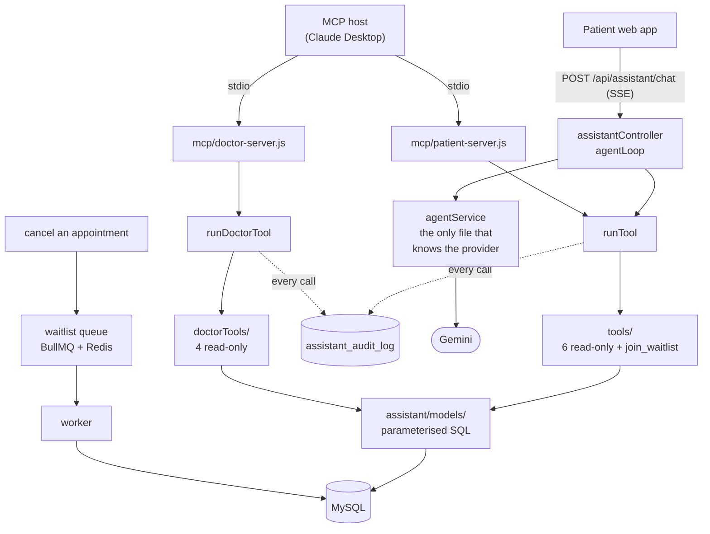

# Prescripto — Doctor Appointment Booking System

A full-stack doctor appointment booking platform where patients browse doctors, book and manage appointments, and doctors and administrators manage schedules through dedicated panels. Built with a React frontend, an Express/MySQL REST API, and a separate admin/doctor panel.

## Live demo

| App | URL |
| --- | --- |
| Patient site | https://prescripto-seven-omega.vercel.app |
| Admin / Doctor panel | https://prescripto-admin-delta-navy.vercel.app |
| API | https://prescripto-backend-4wp6.onrender.com |

> **Note on first load:** the backend runs on a free hosting tier that sleeps after inactivity. The first request may take 30–60 seconds to wake the server; subsequent requests are fast.

### Demo accounts

These accounts are pre-seeded so the app can be tried immediately, without email verification.

| Role | Email | Password |
| --- | --- | --- |
| Patient | demo@prescripto.com | demo1234 |
| Admin | admin@prescripto.com | admin123 |
| Doctor | richard@example.com | doctor123 |

The patient site opens on the Login view with these credentials shown; the admin panel shows the relevant credentials for whichever role (Admin/Doctor) is selected.

## Features

**Patients**
- Browse doctors by speciality, view profiles, and book available time slots
- Manage appointments (view, cancel upcoming ones)
- Edit profile (name, phone, address, date of birth, photo)
- Email verification and password reset flows

**Doctors**
- Dashboard with earnings, appointment counts, and latest bookings
- Mark appointments completed (after their scheduled time) or cancel them
- Manage availability and profile

**Admins**
- Dashboard overview of doctors, patients, and appointments
- Add, edit, and remove doctors
- View all appointments across the platform

## Tech stack

- **Frontend & Admin panel:** React (Vite), Tailwind CSS, React Router, Axios
- **Backend:** Node.js, Express 5, MySQL (`mysql2`)
- **Auth:** JWT with role-based access; bcrypt password hashing
- **Media:** Cloudinary for image uploads
- **Email:** Resend (verification, password reset, doctor onboarding)
- **AI assistant:** Google Gemini, with a tool layer the chat endpoint and two MCP servers share
- **Queue & cache:** BullMQ for durable waitlist notifications; Redis for rate limits, confirmations and the daily model budget (optional — without it these fall back to in-memory)
- **API docs:** OpenAPI 3 generated from route annotations, served at `/api/docs`
- **Infrastructure:** Docker (local orchestration via Docker Compose); deployed on Vercel (frontends), Render (API), and Aiven (managed MySQL)

## Project structure

```
.
├── backend/          Express API, MySQL models, auth, business logic
│   ├── database/     schema.sql, migrations and seed script
│   └── src/          controllers, services, models, middleware, config
│       └── assistant/  tool layer, agent loop, guardrails, audit log
├── mcp/              MCP servers — one for patients, one for doctors
├── frontend/         Patient-facing React app (Vite)
├── admin/            Admin + Doctor React panel (Vite)
├── scripts/          repo tooling (lint ratchet)
├── docs/             build plan and working notes
└── docker-compose.yml
```

## Architecture

The assistant is built around **one tool layer with two kinds of consumer**.



**One tool layer, two kinds of consumer.** The chat endpoint and the MCP
servers reach the same tool functions with no adapter between them. Tools call
the service and model layer directly and never make an HTTP request back to
this API — which is why adding a second transport meant writing a server rather
than rewriting tools.

**Two registries, never one with a role flag.** Patient tools and doctor tools
are separate lists, in separate processes, under separate auth; each server
refuses to start if a tool from the other side appears in its registry. Every
call goes through a runner that writes an audit row, so no tool result reaches a
model unlogged.

## Running locally

You can run the whole stack with Docker in one command, or run each part manually.

### Option A — Docker Compose (recommended)

Requires Docker Desktop. From the repository root, create a `.env` file (used by Compose) based on the variables below, then:

```bash
docker compose up --build
```

This starts MySQL, the API, and both frontends. On first run the database schema is created automatically. Seed the database with sample data:

```bash
docker compose exec backend npm run seed
```

- Patient site: http://localhost:5173
- Admin panel: http://localhost:5174
- API: http://localhost:3000

### Option B — Manual setup

**Prerequisites:** Node.js 22+, a running MySQL 8 instance.

1. **Install dependencies** in each app:
   ```bash
   cd backend && npm install
   cd ../frontend && npm install
   cd ../admin && npm install
   ```

2. **Configure environment variables.** In each of `backend/`, `frontend/`, and `admin/`, copy the matching `.env.example` to `.env` and fill in the values (see below).

3. **Create the database tables.** The seed script fills tables but does not create them, so run the schema first against your database:
   ```bash
   # in MySQL, against your chosen database:
   SOURCE backend/database/schema.sql;
   ```

4. **Seed sample data** (admin, demo patient, specialities, doctors):
   ```bash
   cd backend && npm run seed
   ```

5. **Start the apps** (in separate terminals):
   ```bash
   cd backend && npm run server     # http://localhost:3000
   cd frontend && npm run dev        # http://localhost:5173
   cd admin && npm run dev           # http://localhost:5174
   ```

## Environment variables

Full templates are in each app's `.env.example`. Summary:

**backend/.env**

| Variable | Purpose |
| --- | --- |
| `PORT` | API port (default 3000) |
| `NODE_ENV` | `development` or `production` |
| `JWT_SECRET` | Secret for signing auth tokens |
| `DB_HOST`, `DB_PORT`, `DB_USER`, `DB_PASSWORD`, `DB_NAME` | MySQL connection |
| `DB_SSL` | `true` to enable SSL (managed databases) |
| `DB_SSL_REJECT_UNAUTHORIZED` | `false` to skip CA verification for managed DBs with self-signed CA chains |
| `CLOUDINARY_NAME`, `CLOUDINARY_API_KEY`, `CLOUDINARY_SECRET_KEY` | Image uploads (optional) |
| `RESEND_API_KEY`, `EMAIL_FROM` | Email sending (optional) |
| `FRONTEND_URL`, `ADMIN_PANEL_URL` | Used to build links in emails |
| `ALLOWED_ORIGINS` | Comma-separated CORS allowlist |
| `GEMINI_API_KEY` | Google Gemini key for the AI assistant |
| `GEMINI_MODEL` | Gemini model id (default `gemini-3.6-flash`) |
| `REDIS_URL` | Optional. Rate limits, confirmation tokens, the daily model budget and the waitlist queue use Redis when set; without it they run in memory and a restart clears them |

**frontend/.env** and **admin/.env**

| Variable | Purpose |
| --- | --- |
| `VITE_BACKEND_URL` | Base URL of the API |
| `VITE_CURRENCY` | Currency symbol (admin only) |

Cloudinary and Resend are optional: if unset, image uploads and emails are skipped with a logged warning, and the rest of the app runs normally.

## Design notes

**Re-bookable cancelled slots without race conditions.** Booking uniqueness is enforced at the database level using a generated column: `active_slot` is `NULL` for cancelled appointments and a `doctor_id + date + time` key otherwise, with a unique index on it. Because MySQL allows unlimited `NULL`s in a unique index, cancelled slots free up for re-booking while active appointments still can't be double-booked — and two simultaneous bookings for the same slot resolve to one success and one clean `409`, enforced by the database rather than application logic.

**Appointment fees are snapshotted.** The fee is stored on the appointment at booking time, so an appointment keeps its original price even if the doctor later changes their rate.

**Time rules in SQL, not JavaScript.** Whether an appointment is in the past is computed with `TIMESTAMP(date, time) <= NOW()` in the query, avoiding timezone/serialization bugs.

## Security notes

- **Role-scoped JWTs:** tokens carry a role claim; middleware rejects cross-role use (a doctor token can't call patient endpoints).
- **Rate limiting** on auth endpoints; input validation on registration and doctor management; HTML-escaping of user input in emails; a global error handler that never leaks internal error details to clients.
- **Accepted limitations (by design for this project):**
  - A password reset does not invalidate previously issued JWTs; tokens expire after 7 days.
  - Admin-created doctor accounts receive a temporary password by email so they can set their own on first login.
  - **Email deliverability:** the demo uses Resend's shared test domain, which only delivers to the project owner's address. Arbitrary visitors therefore can't self-verify by email — hence the pre-seeded, pre-verified demo patient. A verified custom domain removes this limitation.
  - **Database SSL / IP allowlist:** the managed database connection disables CA verification (`DB_SSL_REJECT_UNAUTHORIZED=false`) and uses an open IP allowlist, because the free hosting tier lacks static egress IPs and its CA isn't in Node's default trust store. The connection is still encrypted. A production deployment would provide the CA certificate and restrict the allowlist.
  - **Free-tier hosting pauses:** the API and managed database both run on free tiers that sleep during inactivity. The first request after a pause incurs a cold start (see the note above), and if the database is mid-restart the API retries the connection on startup rather than crashing. Paid hosting would remove the pauses entirely.
- **Dependency advisories:** run `npm audit` in each package for the current set. Outstanding items and why they are accepted are tracked under *Known issues* in `docs/agent-plan.md`, rather than restated here where they go stale.

## Future work

- Online payment integration (the schema includes `payment` / `payment_method` scaffolding for this).

## License

© 2026 Ghadi Dababneh. All rights reserved. Published for portfolio review; not licensed for reuse.
